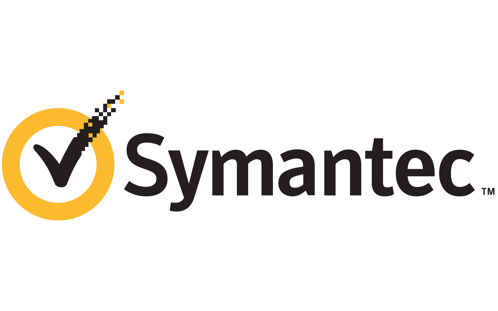

  

# ReadMe – Legal & Licensing Information

Welcome to your Symantec software package. This ReadMe outlines key legal information, licensing terms, and third-party software notices associated with your product.

---

## 📄 Copyright & Trademarks
© 2006 Symantec Corporation. All rights reserved.

- **Symantec** and the **Symantec Logo** are registered trademarks of Symantec Corporation in the U.S. and other countries.
- All other names mentioned may be trademarks of their respective owners.

---

## 💼 Software Classification
This software and its documentation are classified as:
> "Commercial Computer Software" and "Commercial Computer Software Documentation"
under FAR 12.212 and DFARS 227.7202.

---

## 🔍 Third-Party Legal Notices
Some third-party components are:
- Bundled with this Symantec product
- Embedded within it
- Recommended for use alongside it

These components are separately licensed by their respective copyright holders. For the full list of applicable licenses and notices, refer to:
- 📎 Third-Party Legal Notice Appendix
- 📎 Third-Party ReadMe file accompanying this product

---

## ⚙️ Included Open Source Components

### 🚀 Boost v1.33.1
- **Copyright:** Beman Dawes, David Abrahams (1998–2003), Rene Rivera (2004–2005)
- **License:** Boost Software License, Version 1.0 (August 17, 2003)

**Summary of Boost License:**
- Free for use, distribution, and modification (including commercial use)
- Must include full license text and copyright notice
- Provided **AS IS** with no warranty or liability

🔗 [Boost License Details](https://www.boost.org/LICENSE_1_0.txt)

---

### 🧩 TinyXML v2.4.0
- **Author:** Lee Thompson
- **License:** zlib license

**Summary of TinyXML License:**
- Free to use for **any purpose** (including commercial)
- You may **alter and redistribute** freely

**Conditions:**
1. You must not misrepresent the origin of the software.
2. Altered source versions must be clearly marked.
3. License notice must remain intact in source distributions.

🔗 [TinyXML Project](http://www.grinninglizard.com/tinyxml/)

---

## ⚠️ Disclaimer
> The included third-party software is provided **"as-is"**, without warranties of any kind — express or implied. This includes, but is not limited to, warranties of merchantability, fitness for a particular purpose, title, and non-infringement.

Neither Symantec nor the original copyright holders shall be liable for damages arising from use of the software.

---

For further inquiries or to view complete license texts, consult the additional documentation accompanying your Symantec product.

